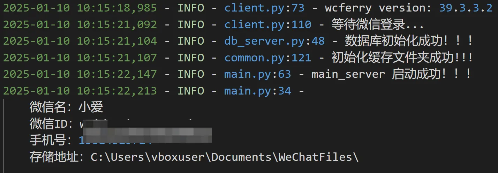

## 📖 1、项目介绍


**一个基于 [WeChatFerry](https://github.com/lich0821/WeChatFerry) 的微信机器人。**

**支持自动拉人，自动群发，入群欢迎，AI回复，关键词回复，定时任务等功能！！**

**注意⚠️：此项目仅供学习交流使用，请勿做违法犯罪行为，否则后果自负！！！**

### 1.1、新手入门

1. [一款微信AI机器人开发框架！稳定可靠，小白友好](https://mp.weixin.qq.com/s/Dq7zw54Dd0p1WgaPKLGanA)

## 📖 2、项目结构

```shell
.
├── data
│   ├── room.db                 # 群数据库
│   ├── user.db                 # 用户数据库
│   └── zaobao_template.json    # 早报模板
├── logs
│   └── app_20250110101504.log  # 日志文件
├── config.yaml                 # 项目配置文件
├── main.py                     # 启动文件
├── requirements.txt            # 项目依赖
├── servers
│   ├── api_server.py           # 接口服务
│   ├── db_server.py            # 数据库服务
│   ├── msg_server.py           # 消息服务
│   └── schedule_server.py      # 定时任务服务
└── utils
    ├── common.py               # 公共函数
    ├── llm.py                  # LLM 接口
    └── prompt.py               # 提示词配置 
```

## ⚡️ 3、快速启动

### 3.1、Bot 启动

**注意：项目依赖 Windows 客户端微信，确保在 Windowns 系统上运行！！！**

首先克隆代码到本地：

```git
git clone https://github.com/hougeai/wcf-wechatbot.git
cd wcf-wechatbot
```

然后复制一份配置文件，并填入必要字段：

```yaml
cp config.yaml.example config.yaml
```

准备好 Python 环境，可参考教程：[环境准备之Conda和VS code安装](https://zhuanlan.zhihu.com/p/688627817)。

使用`pip`安装依赖：

```bash

pip install -r requirements.txt
```

本项目安装的 `WCF` 版本是 `39.3.3.2`，需采用对应的微信客户端版本：

- `wcferry==39.3.3`：[WeChatSetup-3.9.11.25](https://github.com/lich0821/WeChatFerry/releases/download/v39.3.3/WeChatSetup-3.9.11.25.exe)

微信客户端成功登录后，启动`main.py`文件

```
python main.py
```

出现以下界面，代表启动成功：



### ferry bug
1.需要取消勾选控制台中的“快速编辑模式”，不然会出现消息卡住必须敲回车才能响应的bug，此处
2.需要保证首选语言为简体中文

### 3.2、配置文件

项目中所有用到的外部参数，均采用 .yaml 文件进行配置，方便统一管理，可根据自己需求重新定义。

AI 对话、外部接口等，都需要用到 Key，因此只有填入对应字段，对应功能才能生效：


#### 3.2.1、超级管理员配置

填入你的微信号，便于接收机器人的通知消息等。上一篇中有提到，用 wcf 即可获取。

```
Administrators:
  - 'wxid_xsh5ve62e98i12'
```

#### 3.2.2、定时任务配置

定义要实现的定时任务，以及对应的发送时间：
```
scheduleConfig:
  # 定时任务列表
  taskList:
   早报推送: 'morningPage'
   摸鱼日历: 'fishPage'
  # 早报推送时间
  morningPageTime: '10:20'
  # 摸鱼日记推送时间设置
  fishTime: '18:00'
```

#### 3.2.3、进群关键词配置

设置不同关键词，进行自动拉群。
```
roomKeyWord:
  加群:  xxx@chatroom 
```

#### 3.2.4、LLM 接口服务配置

本项目用到的 LLM 主要采用 OneAPI 统一管理，可参考教程：[OneAPI-接口管理和分发神器：所有大模型一键封装成OpenAI协议](https://zhuanlan.zhihu.com/p/707769192) 。

```
llmServer:
  # OneAPI配置
  oa_api_key: 'sk-x'
  oa_base_url: 'http://xxx:4000/v1'
  model_name_list:
   - 'gemini-1.5-flash'
   - 'gemini-1.5-pro'
```

此外，也预留了硅基流动 API key，同样兼容 OpenAI 格式。

```
  # 硅基流动API配置
  sf_api_key: 'sk-x'
```

你只需前往 [硅基流动](https://cloud.siliconflow.cn?referrer=clxv36914000l6xncevco3u1y) 注册账号，并生成一个 API key。


## 4、功能介绍

当前实现如下功能：

### 4.1、定时任务
> 文件位置：`servers/schedule_server.py`

定时任务采用`schedule`库实现，封装为`ScheduleTaskServer`类，每新增一个定时任务，只需添加一个对应函数即可。

- 早报推送: 'morningPage'
- 摸鱼日历: 'fishPage'
- AI晚报: 'aiNews'
- 晚安推送: 'goodNight'
- 节日祝福: 'festival'
- 生日提醒: 'birthday'
- 天气推送: 'weatherReport'

### 4.2、私聊消息处理
> 文件位置：`servers/msg_server.py`
对于`私聊`，`mainHandle`实现的功能如下：
- 超级管理员功能
- 处理加好友请求（当前需微信手机端打开自动通过好友）
- 处理进群请求
- 判断是否有私聊权限
- 处理消息，目前已支持：
  - 文本消息
  - 图片消息
  - 引用消息
  - 公众号/视频号消息

### 4.3、群聊消息处理
> 文件位置：`servers/msg_server.py`

对于`群聊`，`mainHandle`实现的功能如下：
- 判断是否为白名单群聊
- 管理员功能
- 新人入群欢迎
- 处理消息，和`私聊`一样

## ❓ 5、常见问题

```
1、启动失败问题

- 在任务管理器中关闭微信，重新打开即可
```

```
2、机器配置多少才够

- 亲测 1c2g 就能跑。
```


## 🙏🏻 6、致谢：


- https://github.com/lich0821/WeChatFerry

- https://github.com/ngc660sec/NGCBot

- 

## Planned Features

<div align="left">🛠 Building</div>
<div align="left">🔄 Planned</div>

| **Feature**                     | **Description**                                                                            | **Priority** |
| ------------------------------- | ------------------------------------------------------------------------------------------ | ------------ |
| **管理员权限修复**               | 管理员权限修复，修复删白、加推送群、删推送群失败的bug                                           | 🛠            |
| **7天未说话统计 **               | 统计7天没有说话的群员                                                                        | 🛠            |
| **群聊天实时统计**              | 随时@机器人以统计群聊天次数排行，并去重                                                         | 🛠           |
| **去掉冗余功能**                |                                                                                              | 🛠            |
| **llm model配置化**             |                                                                                             | 🔄           |
| **更换免费硅基流动api**          |                                                                                             | 🔄           |
| **根据不同群号配置不同的config 和 prompt** |                                                                                   | 🔄           |